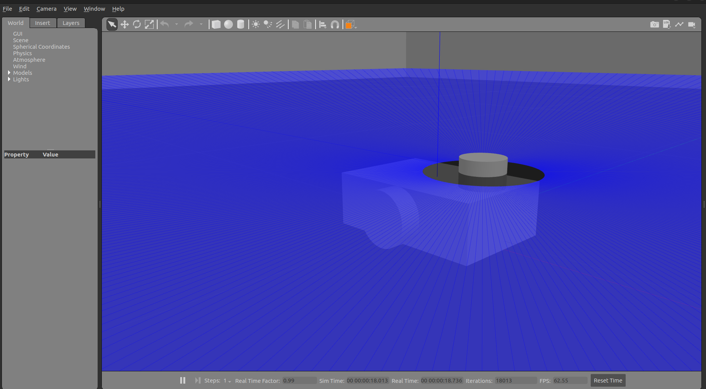
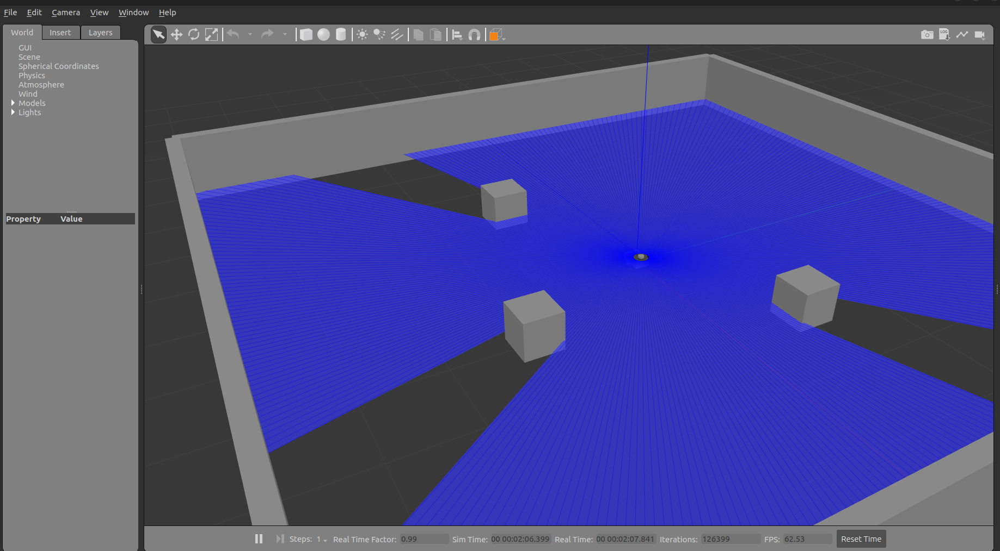
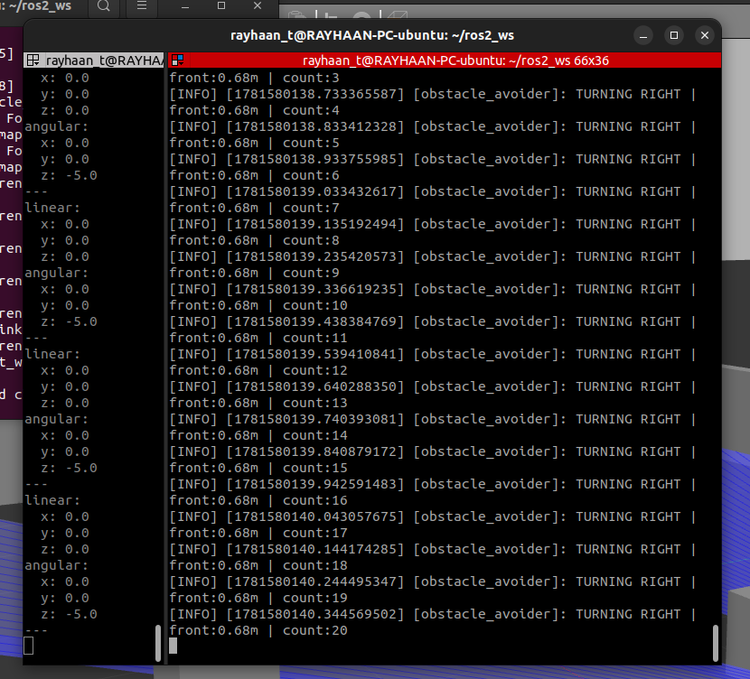

# Obstacle Avoidance Robot — ROS2 Humble + Gazebo

Simulated differential-drive robot that autonomously navigates around an obstacle filled environment,detects obstacles using a LiDAR sensor, and steers away from the the obstacle. Built using ROS2 Humble and Gazebo Classic on Ubuntu 22.04.

---

## Demo

### Robot Close-up with LiDAR Beams


### Full Simulation World


### Live Terminal Output


## Tech Stack

| Tool | Version | Purpose |
|---|---|---|
| Ubuntu | 22.04 | Operating System |
| ROS2 | Humble | Robot middleware framework |
| Gazebo | Classic (11) | 3D physics simulation |
| Python | 3 | Avoidance node logic |
| RViz2 | — | Sensor visualisation |

---

##  Project Structure


ros2_ws/

└── src/

    └── obstacle_avoidance/
    
        ├── obstacle_avoidance/
        
        │   └── obstacle_avoidance_node.py   # Robot brain (state machine)
        
        ├── launch/
        
        │   └── obstacle_avoidance.launch.py # Starts everything with one command
        
        ├── urdf/
        
        │   └── robot.urdf                   # Robot body + Gazebo plugins
        
        ├── worlds/
        
        │   └── obstacle_world.world         # Walled arena with obstacles
        
        ├── setup.py
        
        └── package.xml


---

## 🧠 How It Works

[Gazebo Simulation]
↓
[LiDAR Sensor] → publishes 360° distances → /scan topic
↓
[ObstacleAvoider Node]
reads /scan, decides action
↓
publishes speed → /cmd_vel topic
↓
[Differential Drive Plugin]
spins wheels → Robot moves

### State Machine Logic

The avoidance node runs a 3-state machine to prevent oscillation:

| State | Trigger | Behaviour |
|---|---|---|
| FORWARD | Front clear (> 0.6m) | Move forward at full speed |
| TURNING | Obstacle in warning zone (0.35–0.6m) | Stop, turn in locked direction |
| BACKUP | Obstacle in danger zone (< 0.35m) | Reverse, then transition to TURNING |

Direction (left/right) is **locked once** when entering TURNING — no left-right oscillation!

---

## Prerequisites

- Ubuntu 22.04
- ROS2 Humble ([installation guide](https://docs.ros.org/en/humble/Installation.html))
- Gazebo Classic
- Python 3

Install dependencies:
```bash
sudo apt update
sudo apt install gazebo ros-humble-gazebo-ros-pkgs ros-humble-rviz2
```

---

## Setup

### 1. Clone the repo
```bash
git clone git@github.com:rayhaant-mech27/Obstacle-Avoidance-Bot-Simulation.git ~/ros2_ws
cd ~/ros2_ws
```

### 2. Source ROS2
```bash
source /opt/ros/humble/setup.bash
```

### 3. Build the package
```bash
colcon build --packages-select obstacle_avoidance
source install/setup.bash
```

### 4. Launch the simulation
```bash
ros2 launch obstacle_avoidance obstacle_avoidance.launch.py
```


---

## Common Errors Faced

| Error | Fix |
|---|---|
| `Address already in use` | `pkill -9 -f gzserver && pkill -9 -f gazebo` |
| Robot not turning | Increase `max_wheel_torque` in robot.urdf |
| `RTPS_TRANSPORT_SHM` warnings | export `RMW_IMPLEMENTATION=rmw_cyclonedds_cpp` |

---

## Outcomes

- ROS2 workspace and package structure
- Writing URDF robot descriptions with Gazebo plugins
- Creating Gazebo simulation worlds in SDF format
- Writing ROS2 Python nodes with pub/sub pattern
- State machine logic for robust robot behaviour
- Debugging simulation issues (ghost processes, oscillation, sensor tuning)

---

## Author

RAYHAAN T
Final Year Mechanical Engineering Student | Robotics Enthusiast
📍 Chennai, India
🔗 linkedin.com/in/rayhaan-t-742709290/
